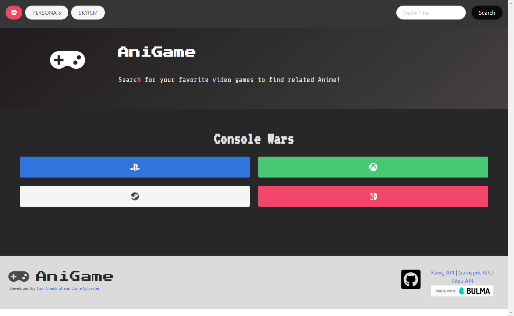

# AniGame

Welcome to AniGame! AniGame was created with gamers like YOU in mind. To get started type the game you are looking for in the searchbar. Related games and animes will appear. To see title summary's simply click anywhere on the grey box and the box will extend revealing additional information. Anime related titles also have an average rating, saving you time and research. Have a favorite way to play? Customize your experience by choosing from xbox, playstation, steam, and nintendo related color schemes. This user-based application was created by Tom Chestnut and Claire Sylvester as a team project for UPENN's Coding Bootcamp, Project 1.

[AniGame Active Link](https://cfsylvester.github.io/AniGame/)




## Installation

[Repository Link](https://github.com/CFsylvester/AniGame)

Click clone or download repository. 

Access terminal.  

Navigate to directory you wish to save the clone to.  

```bash
git clone <paste url here>
```


## Technologies Used

[Bulma Link](https://bulma.io/) 
[GoogleFonts Link](https://fonts.google.com/)
[FontAwesome Link](https://fontawesome.com/)

##License 
[MIT]()
